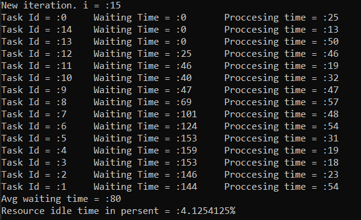
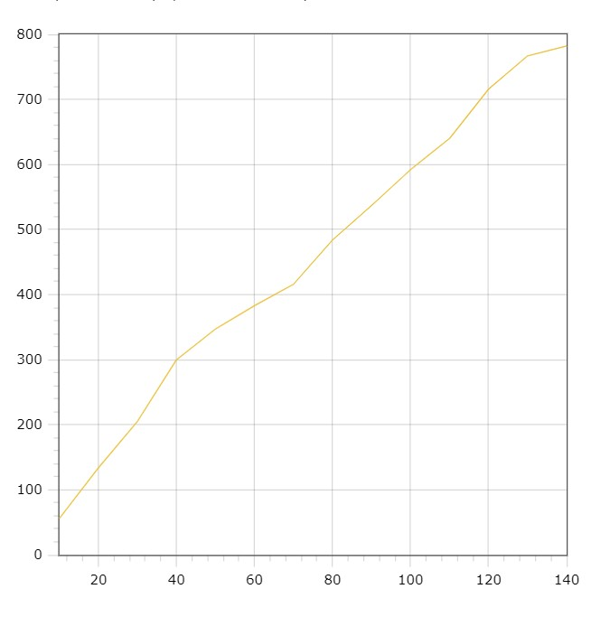
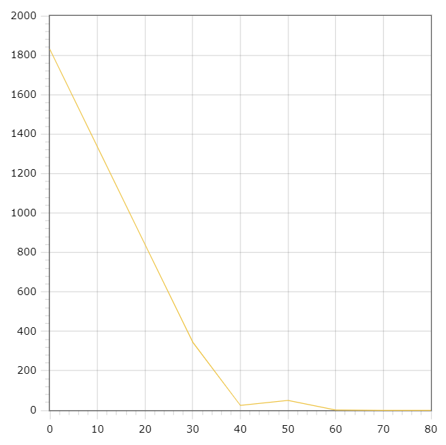
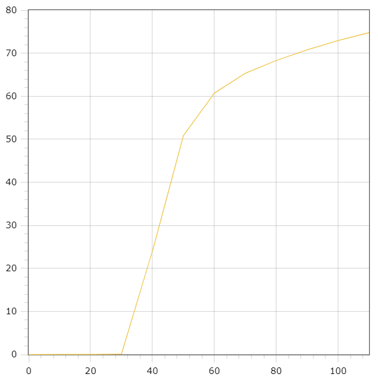

# Алгоритм LIFO (last in - first out)
## Опис Task
- `Id` - унікальний ідентифікатор процесу
- `ExecutionTime` - час який потрібний, для того щоб виконати процес.
## Опис алгоритму
- Вхідні дані: 
  - Інтенсивність вхідного потоку
  - Кількість процесів / завдань. (Task).
  - Мінімальний час виконання процесу.
  - Максимальний час виконання процесу.
- Вихідні дані:
  - Унікальний ідентифікатор процесу
  - Час очікування перед виконанням процесу.
  - Час виконання процесу.
  - Середній час виконання процесу.
  - Відсоток простою ресурсів.
- Алгоритм:
  - Допоки (кількість створених завдань буде менша-рівна заданій кількості завдань) АБО (ресурси будуть заняті) АБО (стек завдань не буде порожнім):
    - Якщо кількість створених завдань менша-рівна заданій кількості завдань:
      - Створити новий процес, із часом виконання, який знаходиться між мінімальним та максимальним часом виконання.
      - Добавити новий процес в стек процесів.
    - Якщо ресурси не заняті і стек не порожній:
      - Витянути останньо добавлене завдання
      - Запустити виконання завдання
      - Вивести дані про завдання
      - Підрахувати час очікування
 - Підрухувати та вивести середній час очікування та відсоток простою ресурсів.
## Приклад
### Керування 15 процесами

## Графіки
### Залежність середнього часу очікування від кількості процесів в стеку.

### Графік залежності середнього часу очікування від інтенсивності вхідного потоку заявок

### Графік проценту простою ресурсу від  інтенсивності вхідного потоку заявок

